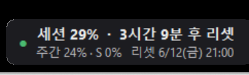

# ClaudeUsage — Claude 사용량 데스크톱 위젯 (Windows)

Claude 구독 플랜의 사용량(5시간 세션 / 주간 한도)을 Windows 데스크톱에 항상 표시하는 초경량 위젯입니다.



단일 C# 소스 파일 하나, **외부 의존성 0** — Windows에 내장된 .NET Framework `csc.exe`만으로 빌드됩니다. NuGet도, 런타임 설치도 필요 없습니다.

## 기능

- **항상 위 HUD** — 반투명 둥근 모서리 오버레이로 사용률 표시, 드래그로 위치 이동
- **간단/상세 모드** — HUD 더블클릭으로 전환 (상세 모드: 윈도우별 사용률 + 리셋 시각)
- **트레이 아이콘** — 사용률 숫자가 아이콘에 표시, 우클릭 메뉴로 표시/숨김·시작프로그램 등록
- **상태 영속** — 위치·표시 여부·모드가 `%APPDATA%\ClaudeUsageTray.cfg`에 저장되어 재부팅 후 복원
- **예의 바른 폴링** — 180초 주기, HTTP 429 시 10분 백오프

## 빌드

```cmd
build.cmd
```

내부적으로 다음을 실행합니다:

```cmd
C:\Windows\Microsoft.NET\Framework64\v4.0.30319\csc.exe /nologo /target:winexe ^
  /codepage:65001 /optimize+ /out:ClaudeUsage.exe /r:System.Web.Extensions.dll ClaudeUsage.cs
```

## 동작 원리

- [Claude Code](https://claude.com/claude-code) 로그인 시 생성되는 `~\.claude\.credentials.json`의 OAuth 액세스 토큰을 **읽기 전용**으로 사용합니다. 토큰을 갱신·저장·전송·출력하지 않습니다.
- `https://api.anthropic.com/api/oauth/usage` 엔드포인트를 조회합니다. (Claude Code 자체가 사용하는 비공식 엔드포인트 — 예고 없이 변경될 수 있습니다.)
- 토큰이 만료되면 위젯에 만료 상태가 표시되며, Claude Code에 다시 로그인하면 자동 복구됩니다.

## 요구 사항

- Windows 10/11 (.NET Framework 4.x 내장)
- Claude Code 로그인 상태 (구독 플랜)

## 주의

이 프로젝트는 Anthropic 비공식이며, 비공개 API를 사용하므로 언제든 동작이 멈출 수 있습니다. 토큰 파일은 절대 수정하지 마세요 — 이 위젯도 읽기만 합니다.

## 라이선스

[MIT](LICENSE)
